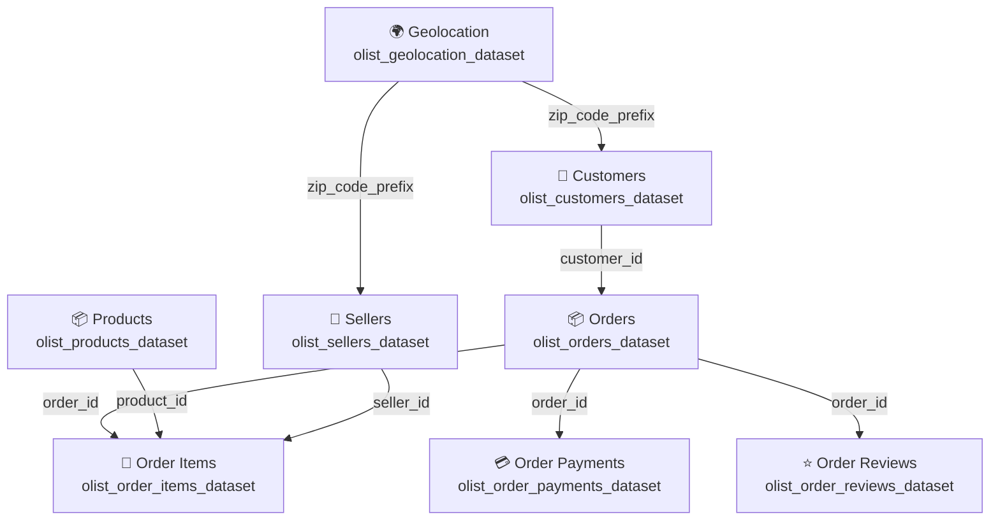

# 🇧🇷 Brazilian E-Commerce Public Dataset by Olist

## 📖 Overview

The **Brazilian E-Commerce Public Dataset by Olist** is a real-world, publicly available e-commerce dataset containing approximately **100,000 orders** placed between **2016 and 2018** across multiple online marketplaces in Brazil.

The dataset enables comprehensive analysis of the entire e-commerce lifecycle, including:

* Order status
* Product information
* Customer details
* Seller information
* Payments
* Shipping and freight performance
* Customer reviews
* Geolocation data

It provides an excellent foundation for building real-world **Data Engineering**, **Analytics Engineering**, **Data Warehousing**, and **Machine Learning** projects.

> **Note:** The dataset contains anonymized commercial data. All company names and partner references appearing in customer reviews have been replaced with names from the *Game of Thrones* universe to preserve privacy.

---

# 📌 Context

The dataset was released by **Olist**, one of the largest department stores operating across Brazilian online marketplaces.

Olist connects thousands of small and medium-sized businesses to major e-commerce marketplaces through a single platform, allowing merchants to manage sales and logistics more efficiently.

The typical order lifecycle is as follows:

1. A customer purchases a product through the Olist Store.
2. The seller receives the order notification.
3. The seller ships the product using Olist logistics partners.
4. The customer receives the order.
5. The customer is invited to complete a satisfaction survey and submit a product review.

---

# 📊 Dataset Highlights

* Approximately **100,000 orders**
* Covers transactions from **2016–2018**
* Multiple related tables following a relational database structure
* Includes customer reviews and ratings
* Contains payment and shipping information
* Includes Brazilian geolocation data (ZIP Code → Latitude/Longitude)
* Suitable for SQL joins and dimensional modeling
* Real commercial data with anonymized customer information

---

# ⚠️ Important Notes

* A single order may contain **multiple items**.
* Each item can be fulfilled by **different sellers**.
* Store and partner names in review text have been anonymized.
* Customer privacy has been preserved throughout the dataset.

---

# 🗂 Dataset Structure

The dataset is divided into multiple relational tables, making it ideal for practicing:

* SQL Joins
* ETL / ELT Pipelines
* Star Schema Design
* Data Warehousing
* Analytics Engineering
* Feature Engineering

---

# 🎯 Potential Use Cases

This dataset is suitable for a wide range of projects, including:

## Natural Language Processing (NLP)

* Sentiment Analysis
* Text Classification
* Review Summarization
* Topic Modeling

## Customer Analytics

* Customer Segmentation
* Customer Lifetime Value (CLV)
* Purchase Behavior Analysis
* Retention Analysis

## Sales Analytics

* Sales Trend Analysis
* Revenue Forecasting
* Seasonal Demand Analysis
* Product Performance

## Delivery & Logistics

* Delivery Performance Analysis
* Shipping Time Optimization
* Freight Cost Analysis
* Delay Prediction

## Product Analytics

* Product Quality Analysis
* Category Performance
* Review Analysis
* Return Prediction

## Machine Learning

* Sales Forecasting
* Customer Churn Prediction
* Recommendation Systems
* Feature Engineering
* Predictive Analytics

---

# 📢 Additional Dataset

Olist has also released a **Marketing Funnel Dataset**, which can be combined with this dataset to analyze the complete customer journey—from marketing acquisition to final purchase.

---

# 🙏 Acknowledgements

Special thanks to **Olist** for making this real-world e-commerce dataset publicly available to support education, research, and the data community.
